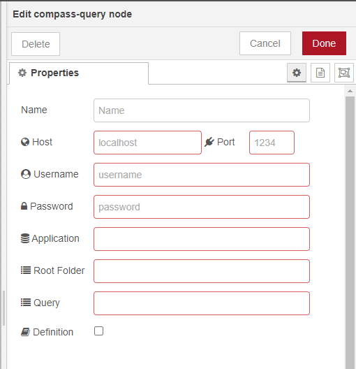

# Compass-Query
The Compass Query node provides the necessary interface to create a connection to HCL Compass for the purpose of extracting data from defined queries.
This repository contains the files necessary to create a Node-RED flow that will extract data from HCL Compass for use in 3rd party software.

## Node Definition

### Node Properties

## Examples
See the example documentation [here] (/example/readme.md)

## Who is this tutorial for?

This overview is intended for Compass Administrators who will assist their organization in providing easy access to Compass data for use in 3rd party software products.  The administrator will be responsible for setting up a Node-RED server and verifying the connection to Compass.

## Pre-requisites
	Compass 2.0.1 + running with the API server
	(localhost:8190)
	At least 1 valid DB/Schema
	1 query used for creating a dashboard called Dashboard Data
	(I used the defect schema and the All Defects query, modified by adding Severity, Owner, and Priority fields)
	
## Install Node-RED
	Follow the directions at: https://nodered.org/#get-started
	localhost:1880
	
## Download the Compass-Query zip file
	- Unzip The contents in a data directory <c:\compassdata>
	- c:\compassdata\compass-custom-nodes-master\ contains the documentation, the packaged node, and the flows necessary for configuration.  
	- c:\compassdata\compass-custom-nodes-master\compass-query contains the source files for packaging the node using npm pack
		
## Configure Node-RED for use
	- Install CSV to JSON node
		Select the Node-RED hamburger icon
		Select Manage Palette
		Select the Install Tab
		Search on CSV
		Select Install for the node-red-contrib-csvtojson
	- To verify
		In your palette, search on csv
	- Install Compass Query  
		This node will be published when it is approved.  These are the temporary directions:
		Find the directory that contains the node-red.cmd file and open a cmd prompt in that location
		>npm install -g d:\compassdata\compass-custom-nodes-master\compass-query-1.0.0.tgz
			This was created by:
			d:\compassdata\compass-custom-nodes-master\compass-query>npm pack
	- To verify the Compass Query node was installed correctly
		In your palette, search on compass
	- Import the Flows:
		In the c:\compassdata\compass-custom-nodes-master directory:
			CompassIntegrationFlows.json (Contains both flows, you only need to import this one)
			CompassPowerBI-flow.json
			CompassTableau-flow.json
		Select the Node-RED hamburger icon in the upper-right corner
		Select Import then Clipboard
		Select file to import
		Select the CompassIntegrationFlows.json file (2 flows and 13 nodes should be imported)
		Double-click the Compass Query node
			Enter the following information for your Compass install:
			host: <localhost>
			port: <8190>
			Username: <admin>
			Password: <>
			Application: <from dropdown 2.0.0-SAMPL>
			Query: <Dashboard Data>
		Select Done
		Deploy the changes by selecting the Node-RED Deploy button.

To Verify that everything is setup correctly, you should be able to open a browser: localhost:1881\compassData.  This will return data in the form of json from your query.

At this point, you are ready to begin testing with Microsoft Power BI

## Execute Query Example 1 
	The Compass Query Node can be configured with a username/password, repo/db, and query.  Each of these can be sent on the URL request as parameters:
		host=localhost
		port=1880
		username=admin
		password=
		queryPath=Personal Queries/Dashboard Data (make sure to replace spaces with %20)
		repo=2.0.0
		db=SAMPL
	http://localhost:1880/compassData?username=admin&password=&queryPath=Personal%20queries/Dashboard%20Data&repo=2.0.0&db=SAMPL

## Execute Query Example 2
	
		host=localhost
		port=1880
		username=admin
		password=
		queryPath=Personal Queries/All Stories (make sure to replace spaces with %20)
		repo=2.0.0
		db=safe
	http://localhost:1880/compassData?username=admin&password=&queryPath=Personal%20queries/All%20Stories&repo=2.0.0&db=safe

## Sub Folders
	When configuring the Compass Query node, only the queries that exist either in the Personal Queries or Public Queries folders will be displayd in the drop down list.  If you need to access a query that is in a subfolder, you will need to use the queryPath parameter as in the following example:
		host=localhost
		port=1880
		username=admin
		password=
		queryPath=Personal Queries/Test2/Test3/All Defects (make sure to replace spaces with %20)
		repo=2.0.0
		db=SAMPL
	http://localhost:1880/compassData?username=admin&password=&queryPath=Personal%20Queries/Test2/Test3/All%20Defects&repo=2.0.0&db=SAMPL	
	
## License

/*
 
 Copyright 2021 HCL Technologies Ltd.

 Licensed under the Apache License, Version 2.0 (the "License");
 you may not use this file except in compliance with the License.
 You may obtain a copy of the License at

     http://www.apache.org/licenses/LICENSE-2.0

 Unless required by applicable law or agreed to in writing, software
 distributed under the License is distributed on an "AS IS" BASIS,
 WITHOUT WARRANTIES OR CONDITIONS OF ANY KIND, either express or implied.
 See the License for the specific language governing permissions and
 limitations under the License.
 
*/

